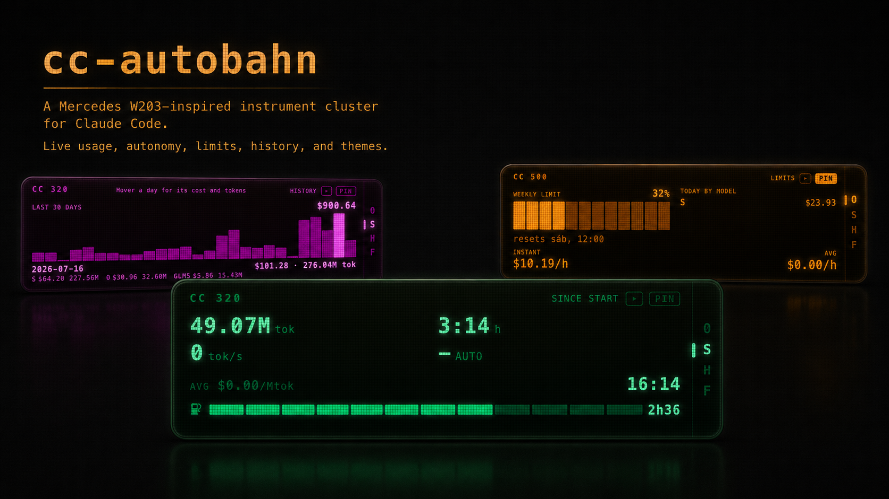
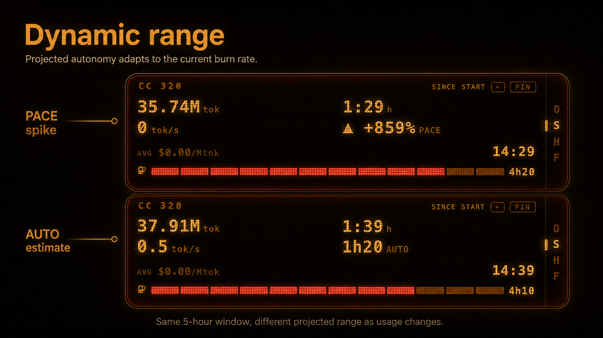
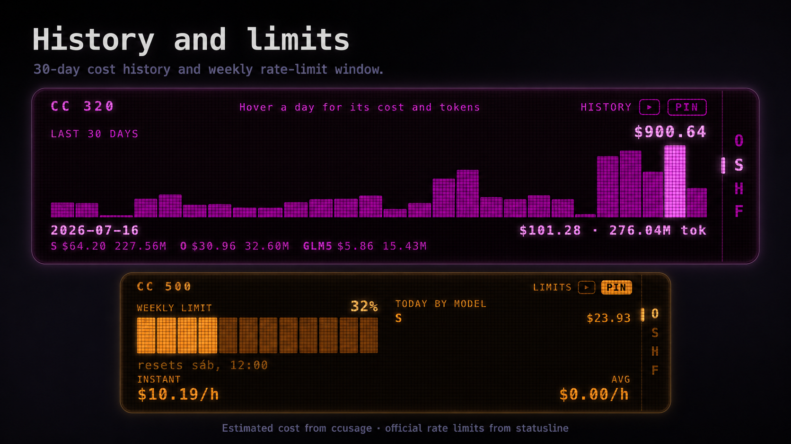

# CC Autobahn

> A **Mercedes W203 instrument cluster** for Claude Code's token consumption.
> It lives as a menu-bar icon on macOS: left click shows/hides a frameless,
> transparent, *always-on-top* panel anchored under the icon, with the amber
> dot-matrix VFD display: `tok/s` per response, remaining 5h window autonomy,
> cost, and active model.

<p align="center">
  
</p>
<p align="center">
  
</p>
<p align="center">
  
  
</p>

## Install

```sh
brew install --cask jmtrs/tap/cc-autobahn
```

That's the whole install. `jmtrs/tap/cc-autobahn` is a **cask** (it ships a
GUI `.app`, not a CLI formula) published on a personal tap
(`jmtrs/homebrew-tap`), not homebrew-core — the `user/tap/formula` shorthand
above resolves it automatically, no separate `brew tap` step needed. Every
release keeps the cask's download URL and checksum in sync with the GitHub
Release, so this one command always tracks the latest version.

**Prefer not to use Homebrew?** Download the `.dmg` from the
[latest release](https://github.com/jmtrs/cc-autobahn/releases/latest) and
drag `cc-autobahn.app` to `/Applications` instead.

Either way, requirements stop at **macOS** (universal build: Apple Silicon +
Intel) and [Claude Code](https://claude.ai/code) — nothing else upfront, the
cluster offers to install its own engine (Bun + ccusage) on first run.

The build is **unsigned** (no Apple Developer ID), so Gatekeeper blocks the
first launch either way. Either right-click the app → **Open** → **Open**,
or run:

```sh
xattr -dr com.apple.quarantine /Applications/cc-autobahn.app
```

First run: click the new menu-bar icon (no Dock, no Cmd+Tab) to show the
cluster. With no engine detected, the **CHECK ENGINE** overlay has an
*Install engine* button that wires everything up on its own.

## What it is

cc-autobahn **is not a token meter: it's a visual skin**. All the usage math
— log parsing, pricing, billing windows — is delegated to
[**ccusage**](https://ccusage.com) by [**@ryoppippi**](https://github.com/ryoppippi),
run as a child process via its `--json` output. It is not forked or
reimplemented: ccusage does the hard, error-prone part (parsing JSONL,
pricing, deduplicating the shared 5h block, the Opus multiplier) and does it
well — this project's only job is the dashboard on top. The one thing
computed in-house is `tok/s` **per response**, which ccusage doesn't offer.

## Features

- **Live speedometer** — `tok/s` per response, with a physical spring on the
  needle: it jumps on completion and decays, rather than faking real-time
  motion the data can't actually support.
- **4-page MFD**, cycled by one button next to PIN — same UX as the W203's
  real trip-computer stalk: trip computer, 30-day cost history, the official
  weekly rate-limit window + per-model cost breakdown, and settings.
- **Official numbers, not guesses** — auto-installs itself as Claude Code's
  `statusLine` (with consent, backup, and rollback) so the autonomy shown is
  the real `rate_limits` window, not an estimate.
- **Tray icon as a live gauge** — a progress ring for the remaining 5h
  window, redrawn at runtime instead of a static icon.
- **Zero setup** — no ccusage or Bun on the machine? one button installs
  both and starts polling, no terminal required.

`cargo test` 34/34, `cargo clippy` clean.

## Design (car → tokens mapping)

| W203 Element               | Claude Code Metric                           |
| --------------------------- | --------------------------------------------- |
| Speedometer (Km/h)          | `tok/s` per response (`Δoutput / Δt_turn`)   |
| Fuel consumption (L/100 Km) | Average cost `$/Mtok`                         |
| Range / fuel tank ⛽        | Remaining 5h window (segment bar)             |
| Trip "AFTER START"          | Tokens/time since last reset                  |
| Odometer                    | Total accumulated tokens                      |
| PRND selector               | Active model (O/S/H/F) lit up + effort        |
| Clock                       | Real time                                     |
| Trip-computer stalk button  | MFD page cycle: trip / history / limits / settings |

## Philosophy

- **Zero friction.** The app wires itself up (engine + statusline sensor)
  with a single consent prompt.
- **Honest precision.** Cost under a subscription is *estimated*; the
  autonomy (`rate_limits`) is *official* data; actual billing is always the
  Claude Console.

## Sources and cadences

| Sensor | Cadence | What it provides |
| ------ | -------- | ------ |
| `ccusage blocks --active --json` | 10–30 s | average burn, projection, cost |
| Tail of `~/.claude/projects/**/*.jsonl` | per turn (event) | `tok/s` per response |
| Statusline JSON (auto-installed sensor) | push | official `rate_limits.five_hour`/`seven_day` |

> **It's not instantaneous.** The JSONL only stamps `usage` when the turn
> closes: the needle jumps on completion and decays, it doesn't react
> mid-generation.

## Development

Requirements: [Node.js](https://nodejs.org/), [Rust](https://rustup.rs/), and
the [Tauri v2 dependencies](https://v2.tauri.app/start/prerequisites/).

```bash
npm install          # Vite + Tauri CLI
npm run tauri dev    # builds Rust and opens the cluster (dev, port 1420)
npm run tauri build  # release binary
```

Backend tests (Rust):

```bash
cd src-tauri && cargo test
```

Regenerate icons from another logo:

```bash
node scripts/make-icon.mjs
npx @tauri-apps/cli icon scripts/source-icon.png
```

## Structure

```
cc-autobahn/
├── index.html          # cluster shell (display, PRND selector, overlays)
├── src/
│   ├── style.css       # amber VFD W203 skin
│   ├── main.js         # thin entrypoint, wires the widgets below
│   └── modules/        # one widget/concern per file (speedometer, MFD pages, overlays, IPC wiring...)
├── src-tauri/
│   └── src/
│       ├── main.rs     # dual entrypoint (GUI / statusline mode) + Tauri bootstrap
│       ├── engine/     # ccusage detection, polling, Bun auto-install
│       ├── burn/       # JSONL tail → tok/s per response
│       ├── sensor/     # statusline auto-install + official rate_limits tail
│       ├── pathfix.rs, tray.rs, tray_icon.rs, window.rs
│       └── ...
├── docs/                # architecture, design, decisions (ADR), roadmap — see below
└── scripts/make-icon.mjs
```

The full per-file breakdown lives in [docs/ARCHITECTURE.md](./docs/ARCHITECTURE.md).

## Documentation

- [docs/ARCHITECTURE.md](./docs/ARCHITECTURE.md) — layers, data flow, why Tauri.
- [docs/DESIGN.md](./docs/DESIGN.md) — W203 visual language, palette.
- [docs/DATA-ENGINE.md](./docs/DATA-ENGINE.md) — ccusage, statusline, OTEL, comparison.
- [docs/DECISIONS.md](./docs/DECISIONS.md) — decision log (ADR) and rationale.
- [docs/ROADMAP.md](./docs/ROADMAP.md) — implementation phases.

## Roadmap

Phases 0–6 done (chassis, data engine, `tok/s` per response, official
statusline sensor, zero friction, tray/menu-bar, polish, MFD history/limits/
settings pages). The real, up-to-date checklist lives in
[docs/ROADMAP.md](./docs/ROADMAP.md) — don't duplicate it here, it gets out
of sync. Only two optional/future items remain: packaging Bun as a Tauri
sidecar, and Windows/Linux support (tray API is cross-platform except
`set_activation_policy`, untested outside macOS so far).

## Credits

cc-autobahn exists because [**ccusage**](https://github.com/ryoppippi/ccusage)
by [**@ryoppippi**](https://github.com/ryoppippi) already solved the hard
problem — parsing Claude Code's JSONL logs, pricing, deduplicating billing
blocks — correctly and reliably. This project doesn't touch any of that; it
just skins ccusage's own `--json` output as a Mercedes instrument cluster. If
you find this useful, go star [ccusage](https://github.com/ryoppippi/ccusage)
too, it's doing all the real work.

## License

[MIT](./LICENSE).
